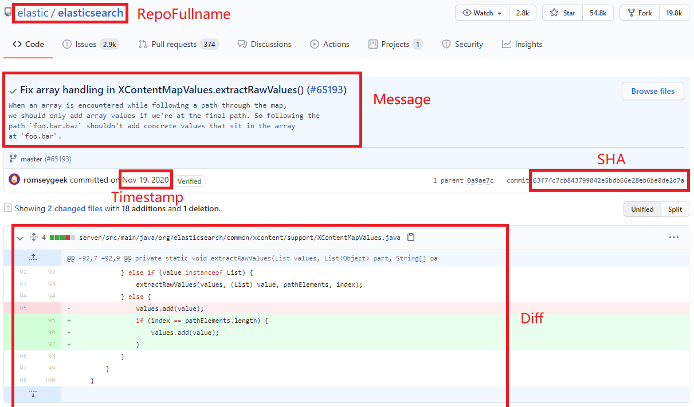

# MCMD | Multi-programming-language Commit Message Dataset

[Download_URL](https://doi.org/10.5281/zenodo.5025758)

This dataset has two version: [Raw](#raw-data) and [Filtered](#filtered-data)

All information can be found in [Raw Data](#raw-data).


## Raw Data


```sh
tar -zxvf raw_data.tar.gz
```

```markdown
|-- raw_data
    |-- cpp
    |   |-- ...
    |   |   |-- ...
    |   |-- Tencent
    |   |   |-- MMKV.pickle
    |   |   |-- mars.pickle
    |   |   |-- ncnn.pickle
    |   |   |-- rapidjson.pickle
    |   |-- ...
    |   |   |-- ...
    |   |-- zhongyang219
    |       |-- TrafficMonitor.pickle
    |-- csharp
    |   |-- ...
    |   |   |-- ...
    |   |-- xupefei
    |       |-- Locale-Emulator.pickle
    |-- java
    |   |-- elastic
    |   |   |-- elasticsearch.pickle
    |   |-- ...
    |   |   |-- ...
    |   |-- zxing
    |       |-- zxing.pickle
    |-- javascript
    |   |-- ...
    |   |   |-- ...
    |   |-- vuejs
    |       |-- vue-cli.pickle
    |       |-- vue.pickle
    |       |-- vuex.pickle
    |-- python
        |-- ...
        |   |-- ...
        |-- yunjey
        |   |-- pytorch-tutorial.pickle
        |-- zulip
            |-- zulip.pickle
```

Under the folder `raw_data`, there are 5 folders named with `Programming Language` including Java(`java`), C#(`csharp`), C++(`cpp`), Python(`python`), and JavaScript(`javascript`).

Under each `Programming Language`  folder, there are many folders named with `Owner Name` such as `elastic`.

Under each `Owner Name` folder, there are many `.pickle` files named with `Repo Name` such as `elasticsearch.pickle`.

(`RepoFullName`  =  `Owner Name`  + `/ ` + `Repo Name` .

For example, `RepoFullName`:[`elastic/elasticsearch`](https://github.com/elastic/elasticsearch) means its `Owner Name`  is `elastic` and its `Repo Name`  is `elasticsearch`.)

`.pickle` files contain <`Diff`,`Message`, `SHA`,`Timestamp`> for each commit which created before 2021.

For example, if you want to see commits of the repository (`RepoFullName`:[`elastic/elasticsearch`](https://github.com/elastic/elasticsearch)), you can use the code below,


```python
import pickle

repo_raw_data = pickle.load(open("raw_data/java/elastic/elasticsearch.pickle","rb"))

```
where `java` is the `Programming Language`, `elastic/elasticsearch` is the `RepoFullName`.

The variable `repo_raw_data`  stores all of the commits in [`elastic/elasticsearch`](https://github.com/elastic/elasticsearch) before 2021.

If you want to see one of the commits, you can use the code below,

```python
repo_raw_data[618]
```
where `618` is the index of the commit.

You can get its `Diff`,`Message`, `SHA`,`Timestamp` by 

```python
repo_raw_data[618]['diff']
repo_raw_data[618]['msg']
repo_raw_data[618]['sha']
repo_raw_data[618]['date']
```

Using `SHA` and `RepoFullName`, you can find the original webpage by https://github.com/`RepoFullName`/commit/`sha` as [https://github.com/elastic/elasticsearch/commit/63f7fc7cb843799042e5bdb66e28eb6be0de2d7a](https://github.com/elastic/elasticsearch/commit/63f7fc7cb843799042e5bdb66e28eb6be0de2d7a).

The `Diff` is equal to the content in https://github.com/`RepoFullName`/commit/`sha` .diff as [https://github.com/elastic/elasticsearch/commit/63f7fc7cb843799042e5bdb66e28eb6be0de2d7a.diff](https://github.com/elastic/elasticsearch/commit/63f7fc7cb843799042e5bdb66e28eb6be0de2d7a.diff).

The `Msg` is equal to the sentences in [https://github.com/elastic/elasticsearch/commit/63f7fc7cb843799042e5bdb66e28eb6be0de2d7a](https://github.com/elastic/elasticsearch/commit/63f7fc7cb843799042e5bdb66e28eb6be0de2d7a).

The `Timestamp` is in [ISO 8601](https://en.wikipedia.org/wiki/ISO_8601) format: YYYY-MM-DDTHH:MM:SSZ.



Code and the results can be seen [here](https://nbviewer.jupyter.org/urls/anonymous.4open.science/r/CommitMsgEmpirical/dataset/DataExplorer.ipynb).

    
    
## Filtered Data


```sh
tar -zxvf filtered_data.tar.gz
```

```markdown
|-- filtered_data
    |-- cpp
    |   |-- sort_random_train80_valid10_test10
    |   |   |-- test.diff.txt
    |   |   |-- test.msg.txt
    |   |   |-- test.repo.txt
    |   |   |-- test.sha.txt
    |   |   |-- test.time.txt
    |   |   |-- train.diff.txt
    |   |   |-- train.msg.txt
    |   |   |-- train.repo.txt
    |   |   |-- train.sha.txt
    |   |   |-- train.time.txt
    |   |   |-- valid.diff.txt
    |   |   |-- valid.msg.txt
    |   |   |-- valid.repo.txt
    |   |   |-- valid.sha.txt
    |   |   |-- valid.time.txt
    |   |-- sort_time_train80_valid10_test10
    |       |-- ...
    |-- csharp
    |   |-- sort_random_train80_valid10_test10
    |   |   |-- ...
    |   |-- sort_time_train80_valid10_test10
    |       |-- ...
    |-- java
    |   |-- sort_random_train80_valid10_test10
    |   |   |-- ...
    |   |-- sort_time_train80_valid10_test10
    |       |-- ...
    |-- javascript
    |   |-- sort_random_train80_valid10_test10
    |   |   |-- ...
    |   |-- sort_time_train80_valid10_test10
    |       |-- ...
    |-- python
        |-- sort_random_train80_valid10_test10
        |   |-- ...
        |-- sort_time_train80_valid10_test10
            |-- ...
```

Under the folder `filtered_data`, there are 5 folders named with `Programming Language` including Java(`java`), C#(`csharp`), C++(`cpp`), Python(`python`), and JavaScript(`javascript`).

Under each `Programming Language`  folder, there are filtered data after different splitting strategies such as `sort_random_train80_valid10_test10`.

Under `sort_random_train80_valid10_test10` folder, there are 3 classes of files including `train`, `valid`, and `test`.

For each class, there are `.txt` files including `diff.txt`,`msg.txt`,`repo.txt`,`sha.txt`,`time.txt`.

For example, if you want to read a commit in `filtered_data/java/sort_random_train80_valid10_test10/train.msg.txt`

```python

train_msg = open("filtered_data/java/sort_random_train80_valid10_test10/train.msg.txt").read().split("\n")
train_msg[18]

```

More code and the results can be seen [here](https://nbviewer.jupyter.org/urls/anonymous.4open.science/r/CommitMsgEmpirical/dataset/DataExplorer.ipynb).

